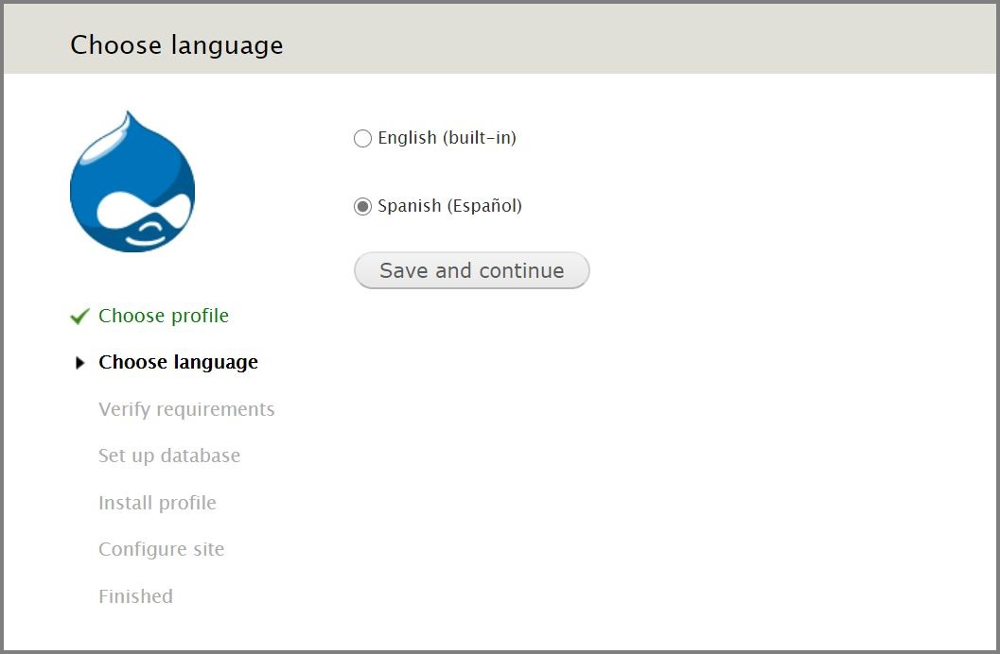

# Old version of Drupal 7 ready to install.

Used by me in my old projects (Drupal 7), kept here only for reference and maintenance purposes.

# Why now?

I am very grateful to Drupal 7, for what it has given me and for the time I have spent with it, although many of my old projects have already been migrated to newer versions of Drupal, I have decided to keep this repository first as a reference and second as a unit of study for the projects still existing in Drupal 7, which are many.

Practically all of us are already working with higher versions of Drupal so I have decided to make this repository public that I kept private.

I hope that the maintainers of old sites find it useful.

No more Drupal 7 projects are development by me from the publication of Drupal 8.

Remember that Drupal 7 ara only supported until November 2022.

# Master Branch (CLEAN INSTALL).

In the MASTER branch I have decided to keep Drupal 7 clean and ready to install manually, as we have done so many times.

So if you want to install Drupal 7 locally or on your Server, just do a ```GIT CLONE``` of the MASTER branch to start.

- Update to 7.72
- Spanish core locale file included.

Does not contain any customization.

Simple do:

```console
$ git clone --branch master https://gitlab.com/jsampedro/drupal-7.git yourfolder
```

Go to localhost or your host name on hosting and install it.

Remenber to select Spanish locale or English.

<div align="center">
  
</div>

# Development Branch (INSTALLED).

Perhaps I should have chosen the name "Installed" for this branch, but we are all more familiar with the terminology used.

The real objective of this branch is to obtain a Drupal 7 and its Database with my personal selection of modules already installed and ready to use.

# The problem.

The way of working in Drupal 7 has been more or less the same until in the most modern versions the use of ```COMPOSER``` has been adopted.

Download Drupal, install it, download the modules and libraries one by one and install it.

Repeat it over and over again every time you need to start or every time you mount a new project.

(More advanced users could also solve the problem by using ```DRUSH``` to install and a SCRIPT with the modules to be installed also with ```DRUSH```, or not)

# This Way.

My way of working is very simple.

## On your personal development pc or localhost:

### Step 1

Clone this repository in your folder by selecting the DEVELOPMENT branch

```console
$ Git clone --branch development https://gitlab.com/jsampedro/drupal-7.git yourfolder
```
### Step 2

Restore the Database.

### Step 3

Enter with user: admin and password: drupal.

Ready.

## On a remote computer or Hosting.

The same, but remember to edit the ```SETTINGS.PHP``` file and change the name of the server and the name of the database to that of your server.

# And now ?

Logically, the first thing to do is change your administrator password.

And the second that you create a repository for your project and use this branch as your development branch.

We already have Drupal ready, the next thing I usually do if it is a migration or update, enable the Backup and Migrate module and load the content.

Take some time to review the list of modules and libraries installed, nothing is enabled by default.

You can uninstall the modules from my list that are not needed or want or simply leave them disabled.

Add the modules that your project needs.

# Be free to star again.

If you break everything, start over, that's how you learn, that's why I use GIT.

At least you won't have to repeat the tedious installation process.

# Why you don't use DRUSH to update your projects and modules ?

I use ```Drush``` in drupal 7 every day.

The problem is not that, some clients and projects decide not to pay maintenance, or simply the projects have not been updated for years.

In this case, it is more comfortable for me to create a new local site by this procedure, make a copy of the content of the outdated site using Backup and Migrate, restore it locally, make the necessary changes and when it is ready to put the new version on the server.

# Development Branch some notes.

In the DEVELOPMENT branch I have included all the modules and libraries that I have used in my projects, it is a long list and it is very likely that many are not needed in the same project and at the same time, the reason that they are all included is that this It allows me to do the updates without worrying about which modules that project has, then I eliminate the ones that are not used.

- Includes the Database, to import it.
- Database user: root
- Database password is clear.
- Database name: drupal7.
- Drupal username: admin
- Drupal password: drupal
- Only administrator allow to create accounts.
- Core disabled modules:
  + Color
  + Overlay
  + Comment
  + Help
- Includes ```settings.php``` with the usual configurations to avoid the most common errors.
- Remenber to change, mail@mail.com, user and password.

# Custom modules added by me.

My personal selection of modules, used by default in my projects.

In the last resivision I have eliminated many that I consider that they are no longer necessary or that I prefer to do the same by hand, following a policy of "Fewer modules are better" but although many of the modules we already know that their functionality can be done "by hand "I keep them for compatibility with old sites.

## About SECURITY section.

I have grouped all the SECURITY modules in the same section.

Most of the modules in this section do not have configured:

```yml
package = "Security"
```
In your .info file

So most of them end up in the OTHERS section where there are already many modules and it is very annoying to find them.

For this I have modified the .info file of each module by hand, so if you update any of these modules, you will lose that customization and will have to redo it by hand.

Any alternative solution is welcome, logically the best would be for these developers to include their modules in the correct category.

## Available Modules

Only "Navbar" module are enable by defauld in this branch, libraries are included.

# Modules List.

As they appear on the Drupal modules screen, the order may vary depending on the language of your installation.

- Administration
  + Navbar
- Fields type
  + Email
  + Link
  + Entity reference
- News Chanels (Import data)
  + Feeds
- Spam Control
  + Captcha
  + reCaptcha
  + Honeypot
- Analytics
  + Google Analytics
- Development
  + Database Optimization
  + Devel
- EntityForms
  + EntityForms
- Time/Date
  + Date
  + Week day field
- Input Filters
  + Pathologic
- User interface
  + jQuery Update
  + Wysiwyg
- CHAOS TOOL SUITE
  + CHAOS Tools
- Sitemap
  + XML Sitemap
- Menu
  + TB Mega Menu
- Multilingual
  + Localization client
  + Localization update
- Multimedia
  + File Entity
  + Media
  + PDF Preview
  + SVG Embed
- Plus/Others
  + Automatic Nodetitles
  + Backup and Migrate
  + Block Attributes
  + Block Class
  + Checklist API
  + Empty Front Page
  + Entity API
  + EU Cookie Compilance
  + Job Scheduler
  + Exclude node title
  + Font Awesome
  + Node clone
  + Password toggle
  + Pathauto
  + Prev/Next
  + RobotsTxt
  + Simple Google Maps
  + Sitemap
  + Site Verification
  + Special Menu Items
  + Token
  + Transliteration
  + Ultimate Cron
- Panels
  + Panels
  + Panels BootStrap Layout
- Rules
  + Rules
- SECURITY
  + Copy Prevention
  + Flood Control
  + Flood Unblock
  + IP Ranges
  + Login Security
  + Paranoia (Plus Paranoia Sanitize)
  + No request new password
  + Password policy
  + Security Kit
  + Security Review
- SEO
  + Metatag
  + SEO Checklist
- Display Suite
  + Display Suite
- Variable
  + Variable
- Views
  + Better Exposed Filters
  + Views
  + Views BootStrap
  + Views Conditional
  + Views Field View
  + Views PDF Display
- Webform
  + Webform

# Libraries Modules and libraries added by module dependencies.

Special mention should be made of the libraries module that is used to load libraries used by other modules
They can be found in /sites/all/libraries, all updated to the latest versions with the exception of those that need a module in a specific version.

- Libraries
  + Backbone JavaScript library
  + Underscore JavaScript library
  + Modernizr custom build
  + tcpdf (6.0.0.22)
  + fpdi (1.6.2)
  + Tinymce

# What have I not included?

I have not included the translation files because they are not necessary to start and to make the process faster, update the translations manually through the configuration options.

<div align="center">
  
</div>

# End.
This is all, thanks to the thousands of people who made the Drupal 7 project possible and have continue to enjoy this great CMS.