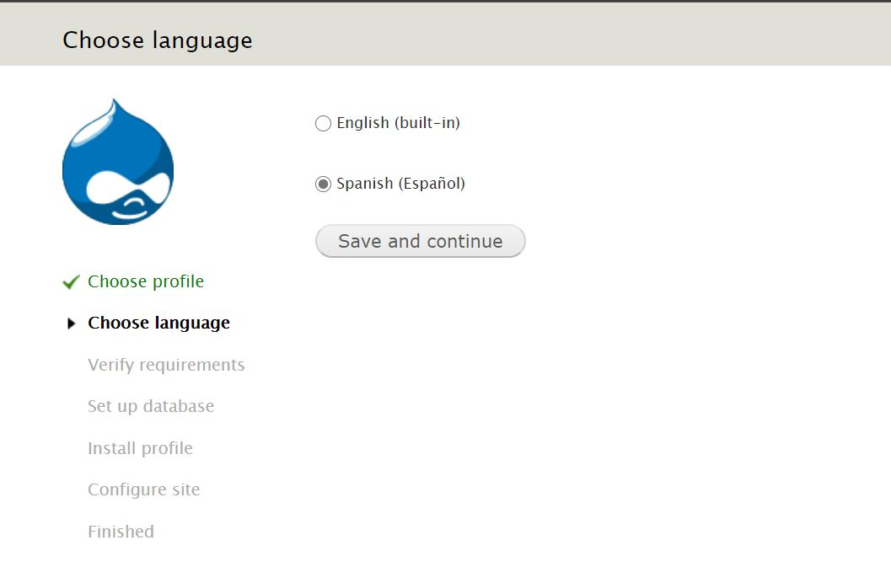

# Old version of Drupal 7 ready to install.

Used by me in my old projects (D7), kept here only for study and maintenance purposes.

No more Drupal 7 projects are development by me from the publication of Drupal 8.

Supported until November 2022. Use this version for sites already running Drupal 7.

- Update to 7.72
- Spanish core locale file included.

  

