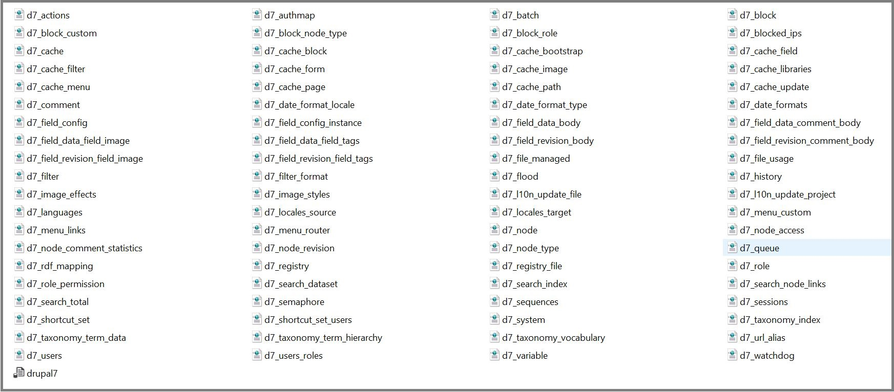

# Old version of Drupal 7 ready to install.

Used in my old projects (Drupal 7), kept here for reference and maintenance purposes only.

No more Drupal 7 projects are development by me from the publication of Drupal 8.

Remember that Drupal 7 ara only supported until November 2022.

I hope that the maintainers of old Drupal 7 sites like me, find it useful.

# Master Branch (Clean install).

In the MASTER branch I have decided to keep Drupal 7 clean and ready to install manually.

So if you want to install Drupal 7 locally or on your Server, just do a ```GIT CLONE``` of the MASTER branch to start.

- Update to 7.72
- Spanish core locale file included.

Does not contain any customization.

Simple do:

```console
$ git clone --branch master https://github.com/jsampe/drupal7.git yourfolder
```

Go to localhost or your host name on hosting and install it.

Remember that you have Spanish Locale available.

<div align="center">
  
</div>

# Development Branch (Installed version).

The objective of this branch is to make a rapid deployment of Drupal 7 with its database and modules ready to use.

# This Way.

This way of working is very simple.

### Step 1

Clone this repository in your folder by selecting the DEVELOPMENT branch

```console
$ Git clone --branch development https://github.com/jsampe/drupal7.git yourfolder
```
### Step 2

Restore the Database.

### Step 3

Enter with user: admin and password: drupal.

You are finish.

## On a remote computer or Hosting.

The same, but remember to config the ```SETTINGS.PHP``` file whit the name of the server and the name of the database to that of your server.

# And now ?

Change your admin password.

Take some time to review the list of modules and libraries installed, nothing is enabled by default except Navbar module.

You can uninstall the modules from my list that are not needed or want or simply leave them disabled.

Next, add the modules that your project needs.

# Development Branch some notes.

In the DEVELOPMENT branch I have included the modules and libraries that I have used, it is a long list and it is very likely that many are not needed in the same project and at the same time.

The reason that they are all included is that this It allows me to do the updates of my projects without worrying about which modules that project has, then I eliminate the ones that are not used.

- Includes the Database, to import it.
- Database user: root
- Database password is clear.
- Database name: drupal7.
- Drupal username: admin
- Drupal password: drupal
- Only administrator allow to create accounts.
- Core disabled modules:
  + Color
  + Overlay
  + Comment
  + Help
- Includes ```settings.php``` with the usual configurations to avoid the most common errors.
- Remenber to change, mail@mail.com, user and password.

# Modules added by me.

Many of the modules on this list I keep for compatibility with older sites. Although I no longer use them.

## About SECURITY section.

I have wanted to group all the security modules under the same group. SECURITY, Many of the security modules have not declared:

```yml
package = "Security"
```
In the .info file of the module.

Due to this, most of them ended up in the category OTHERS where there are already many modules, and it is annoying to find them.

I have modified the .info file of each module by hand, so if you update any of these modules, you will lose that customization.

So if you want to keep this order, remember to edit the file again and make the change.

## Activated Modules

Only "Navbar" module are enable by defauld in this branch.

# Modules List.

As they appear on the Drupal modules screen, the order may vary depending on the language of your installation.

- Administration
  + Navbar
- Fields type
  + Email
  + Link
  + Entity reference
- News Chanels (Import data)
  + Feeds
- Spam Control
  + Captcha
  + reCaptcha
  + Honeypot
- Analytics
  + Google Analytics
- Development
  + Database Optimization
  + Devel
- EntityForms
  + EntityForms
- Time/Date
  + Date
  + Week day field
- Input Filters
  + Pathologic
- User interface
  + jQuery Update
  + Wysiwyg
- CHAOS TOOL SUITE
  + CHAOS Tools
- Sitemap
  + XML Sitemap
- Menu
  + TB Mega Menu
- Multilingual
  + Localization client
  + Localization update
- Multimedia
  + File Entity
  + Media
  + PDF Preview
  + SVG Embed
- Plus/Others
  + Automatic Nodetitles
  + Backup and Migrate
  + Block Attributes
  + Block Class
  + Checklist API
  + Empty Front Page
  + Entity API
  + EU Cookie Compilance
  + Job Scheduler
  + Exclude node title
  + Font Awesome
  + Node clone
  + Password toggle
  + Pathauto
  + Prev/Next
  + RobotsTxt
  + Simple Google Maps
  + Sitemap
  + Site Verification
  + Special Menu Items
  + Token
  + Transliteration
  + Ultimate Cron
- Panels
  + Panels
  + Panels BootStrap Layout
- Rules
  + Rules
- SECURITY
  + Copy Prevention
  + Flood Control
  + Flood Unblock
  + IP Ranges
  + Login Security
  + Paranoia (Plus Paranoia Sanitize)
  + No request new password
  + Password policy
  + Security Kit
  + Security Review
- SEO
  + Metatag
  + SEO Checklist
- Display Suite
  + Display Suite
- Variable
  + Variable
- Views
  + Better Exposed Filters
  + Views
  + Views BootStrap
  + Views Conditional
  + Views Field View
  + Views PDF Display
- Webform
  + Webform

# Libraries Module and libraries added by module dependencies.

Special mention should be made of the libraries module that is used to load libraries used by other modules.
Libraries can be found in /sites/all/libraries, all updated to the latest versions with the exception of those that need a module in a specific version.

- Libraries
  + Backbone JavaScript library
  + Underscore JavaScript library
  + Modernizr custom build
  + tcpdf (6.0.0.22)
  + fpdi (1.6.2)
  + Tinymce

# DATABASE FOLDER.

The DATABASE folder that is included in the development branch contains a drupal7.sql file ready to restore with phpmyadmin or your database manager.

I have also included an individual copy of each table in the database in XML format, which can be useful if only one table needs to be restored.

+ One drupal7.sql file
+ 80 individual XML files, one for table.
+ (81 Files Total)

<div align="center">
  
</div>

# What have I not included?

I have not included the translation files because they are not necessary to start and to make the process faster, update the translations manually through the configuration options.

<div align="center">
  
</div>

# Final note.

About other branches that there might be,

It can happen, although it is not usual, because my Drupal 7 sites have been finished for years. That I need to try a new module. In that case, they will always be in a branch one level below DEVELOPMENT with its corresponding database.